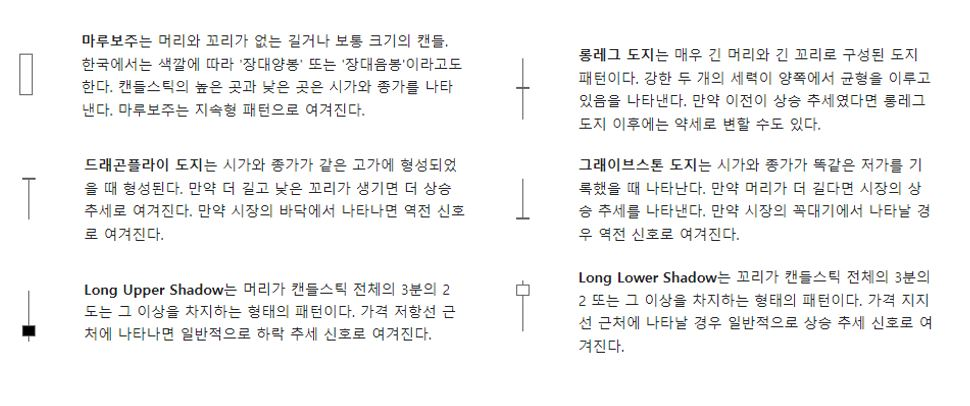

# ML-Pattern-Trading, CUK-Report

# 1. 캔들스틱 지도 학습(Classification ) 


#### 아래 그림의 캔들스틱 6가지 패턴을 분류해서 학습 시켜보자.




## 1.1 데이터 수집 및 전처리 

수집된 데이터를 가지고 캔들스틱 Label을 붙이는 작업을 실시하고, 2개의 csv파일을 준비한다.

1. **시가, 고가,  저가 , 종가** 가 명시된 csv 파일
2. **머리, 몸통, 꼬리** 가 명시된 csv 파일
3. 

#### code(mql)

```cpp
#property copyright "NotePad"
#property strict
#property script_show_inputs

#include <Generic/HashMap.mqh>
#include <Generic/ArrayList.mqh>
#include <Log4mql/log4mql.mqh>

CArrayList<int> long_doji, df_doji, gs_doji, lower_marubozu, upper_marubozu, long_upper_shadow, long_lower_shadow;
CArrayList<int> bodys, heads, tails;
int OnInit()
{
   for (int i = 1; i < Bars; i++)
   {
      int body = GetBody(i);
      int head = GetHead(i);
      int tail = GetTail(i);
      bodys.Add(body);
      heads.Add(head); 
      tails.Add(tail);

      //collect doji
      if(body == 0)
      {
         if(tail >= 50 && head >= 50) long_doji.Add(i);
         if(head == 0 && tail >= 50) df_doji.Add(i);
         if(tail == 0 && head >= 50) gs_doji.Add(i); 
      } 

      //collect marubozu
      if (head+tail == 0)
      {
         if(body >= 50) upper_marubozu.Add(i); 
         else if(body <= -50) lower_marubozu.Add(i);
      }

      //collect shadow
      if(head <= 1 && body >= 10)
         if (body*3 <= tail*2) long_upper_shadow.Add(i);
      if(tail <= 1 && body <= -10)
         if (body * -1 * 3 <= head * 2) long_lower_shadow.Add(i);
   }
   CSVWrite()
   return (INIT_SUCCEEDED);
}

void CSVWrite()
{
   //--- open the file for writing the indicator values (if the file is absent, it will be created automatically)
   ResetLastError();
   int file_handle1=FileOpen("basic_data.csv",FILE_READ|FILE_WRITE|FILE_CSV, ',');
   int file_handle2=FileOpen("processed_data.csv",FILE_READ|FILE_WRITE|FILE_CSV, ',');
   if(file_handle1 !=INVALID_HANDLE && file_handle2 != INVALID_HANDLE)
     {
      //--- first, write the number of signals
      Write(long_upper_shadow, file_handle1, file_handle2, 0);
      Write(long_lower_shadow, file_handle1, file_handle2, 1);
      Write(upper_marubozu, file_handle1, file_handle2, 2);
      Write(lower_marubozu, file_handle1, file_handle2, 3);
      Write(long_doji, file_handle1, file_handle2, 4);
      Write(df_doji, file_handle1, file_handle2, 5);
      Write(gs_doji, file_handle1, file_handle2, 6);
      //--- close the file
      FileClose(file_handle1);
      FileClose(file_handle2);
     }
   else
      PrintFormat("Failed to open file, Error code = %d",GetLastError());
}

void Write(CArrayList<int> &list, const int handle1, const int handle2, const int label)
{
   //--- write the time and values of signals to the file
   for (int i = 0; i < list.Count() && i < 1000; i++)
   {
      int body, tail, head, index;
      list.TryGetValue(i, index);
      bodys.TryGetValue(index, body);
      tails.TryGetValue(index, tail);
      heads.TryGetValue(index, head);
      FileWrite(handle1, Open[index], High[index], Low[index], Close[index], label);
      FileWrite(handle2, body, tail, head, label);
   }
}

int GetBody(const int index)
{
   double gap = Close[index] - Open[index];
   gap = NormalizeDouble(gap*(1.0/_Point),1);
   return (int)gap;
}

int GetHead(const int index)
{
   double head = (Close[index] > Open[index]) ? High[index]-Close[index] : High[index] - Open[index];
   head = NormalizeDouble(head*(1.0/_Point),1);
   return (int)head;
}

int GetTail(const int index)
{
   double tail = (Close[index] > Open[index]) ? Open[index]-Low[index] : Close[index] - Low[index];
   tail = NormalizeDouble(tail*(1.0/_Point),1);
   return (int)tail;
}

void OnTick()
{
}
```

#### code(python)

```python
```

